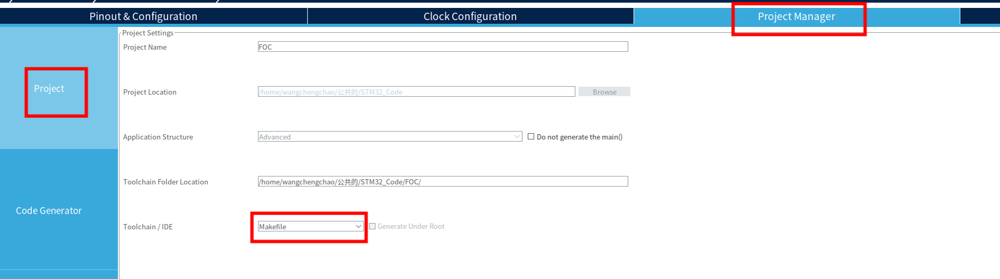
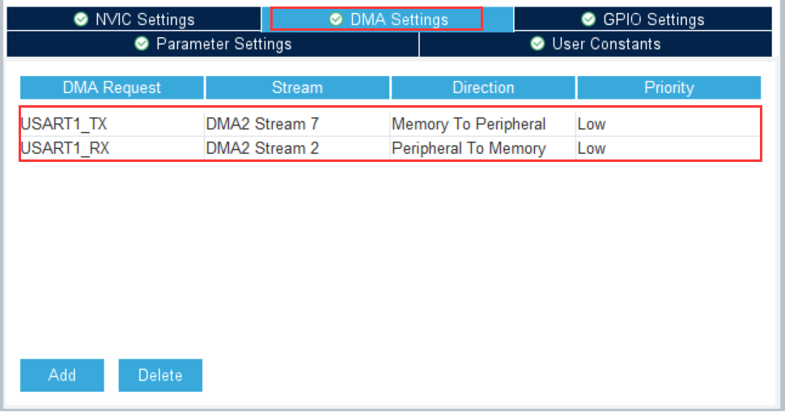
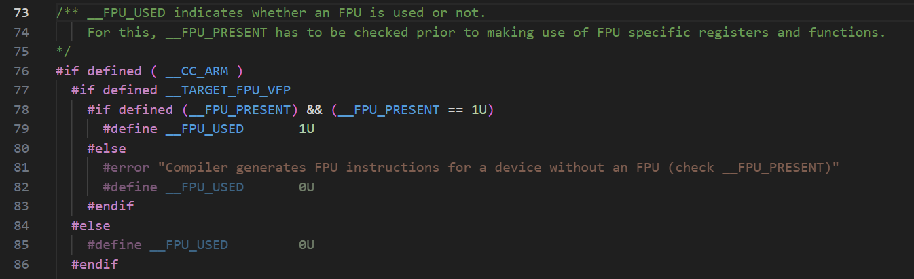

### 试验报告：

目的：学习STM32嵌入式编程，掌握STM32硬件资源的使用，实现STM32控制五刷直流电机实现FOC控制算法，并将电机转速、转向等信息显示在屏幕上。

[TOC]

------


### 一、准备工作

#### 1、硬件

- 正点原子STM32F429IGT6单片机
- DAP仿真器
- SPI屏幕（240*320分辨率）
- 2804无刷直流电机+AS5600霍尔传感器
- simpleFOC电机驱动

#### 2、开发环境安装

​		在ubuntu22.04或者windows系统下搭建代码编程、编译、烧录和调试工具均可，下面展示在ubuntu系统下的安装过程，windows下的安装类似，不过从命令行改为运行安装所需的.exe文件，windows安装涉及到环境变量的配置，相比之下还是要麻烦一点，这不是重点，就不展示了：

##### （1）代码编写：

​		vscode（必需）+扩展：ChineseSimplified+C/C++（必需）、Makefile Tools、Cortex-Debug（必需）、Github Copilot (https://code.visualstudio.com/)

​	STM32主流的代码编程软件是keil，相比于keil，使用vscode编写代码更加快速高效，因为vscode的代码补全功能非常强大，而且代码颜色高亮，警告和错误提示更加明显，其中包含了很多好用的扩展，比如Github Copilot是github推出的人工智能，辅助代码编写和解决各种代码编译问题，代码编程体验很好，这些都是开源免费的，而且可以跨平台使用；缺点就是编译和调试不方便，不如keil专业，其中很多功能的实现依靠外在的编译器和调试器还有插件，本身只是一个代码编辑工具，不如keil专业，出了问题很难找。都用了之后发现，keil是丑了点，但他是真好用。


##### （2）代码初始化配置：

​		STM32CubeMX (https://www.st.com/en/development-tools/stm32cubemx.html)


##### （3）代码编译与调试工具：

​		arm-none-eabi交叉编译工具 (https://developer.arm.com/downloads/-/gnu-rm)


​	该交叉编译工具包括arm-none-eabi-gcc和arm-none-eabi-gdb，前者用于编译，后者用于调试。

##### （4）安装gdbserver：

​		在终端依次输入下面的命令：

```
wget https://ftp.gnu.org/gnu/gdb/gdb-14.2.tar.xz
tar -xvf gdb-14.2.tar.xz
./configure
make
sudo make install
```

##### （5）开源调试器：pyocd或openocd

​		两者都是用于烧录和调试cortex-M系列的工具，支持CMSIS-DAP、ST-Link等系列的仿真器。（本来我都想用openocd的，结果ubuntu环境配置一直没有成功，端口报错，没有解决，所以放弃了，改用pyocd，在windows系统还是用的openocd，两者所能实现的功能基本是一致的）

```
sudo apt update                                #更新源
sudo apt install python3-pip                   #安装pip
python3 -m pip install --upgrade --force pip   #更新pip
python3 -m pip install -U pyocd                #安装pyocd
pyocd -V                                       #验证是否安装成功，若输出pyocd的版本则安装成功
```

​	pyocd用法详见：https://github.com/pyocd/pyOCD

#### 3、平台搭建

##### （1）stm32cubemx配置

- help->manage embedded software packages，找到最新的stm32f4的芯片支持包->install


- file->new project，搜索STM32F429IGT6，选择合适的芯片型号，选择start project


- 设置时钟源：


- 设置sys：


- 设置一个单片机上驱动LED的GPIO，检测程序是否能正常运行：


- 时钟树配置：


- 生成工程模板：




​	在配置完成后再点击右上角的GENERATE CODE，生成成功后点击open folder


##### （2）vscode配置：

- 在打开的文件夹中，右键鼠标，选择“在终端中打开”，输入`code .`，用vscode打开工程，然后选择“信任文件夹”


- ctrl+shift+p，输入`edit configurations(UI)`打开


- 指定编译器路径为之前安装的arm-none-eabi-gcc的路径，指定intellisense模式为`linux-gcc-arm`


- 打开“Makefile”文件，找到`# C defines`，复制后两条，粘贴到`定义`，去掉`-D`和多余的`\ `


##### （3）测试

- 在main.c的while(1)中添加如下测试代码，每隔一秒led灯闪烁一次

```
HAL_GPIO_WritePin(GPIOB, GPIO_PIN_0, GPIO_PIN_SET);
HAL_Delay(1000);
HAL_GPIO_WritePin(GPIOB, GPIO_PIN_0, GPIO_PIN_RESET);
HAL_Delay(1000);
```

- 在vscode的终端输入`make`，查看是否编译成功，编译文件在工程目录的./build文件夹下：


- 用DAP仿真器连接单片机与电脑usb，在终端输入`pyocd list -p`，看是否能找到DAP仿真器，我的DAP仿真器对应的`Unique ID`为`ATK 20210914`，而且pyocd没有识别出我的芯片型号（Target)


- 烧录程序，观察PB0对应的LED是否每隔一秒闪烁一次，在终端输入：

```
pyocd flash ./build/FOC.hex -t stm32f429xi 
```


- 调试程序：在终端输入 pyocd gdbserver，具体的终端调试方法还是见pyocd github官网


##### （4）配置json文件

​	经过以上配置，已经可以实现编译、烧录和调试了，但是这些都是在终端用命令行进行的，并不方便，用vscode肯定是要利用他的图形界面了，所以通过配置.json文件，来自动实现以上过程。

- 配置task.json

​	终端 -> 配置任务... -> 使用模板创建.json文件 -> othors（随便选一个都行），生成tasks.json文件，替换为如下内容：

```
{
    "version": "2.0.0",
    "tasks": [
        {
            "label": "Build",
            "type": "shell",
            "command": "make",
            "args": [],
            "group": "build",
            "problemMatcher": [
                "$gcc"
            ]
        },
        {
            "type": "shell",
            "label": "Build & Update",
            "command": "pyocd",
            "args": [
                "flash",
                "./build/FOC.hex",
                "-t",
                "stm32f429xi",
            ],
            "dependsOn": "Build",
            "problemMatcher": [
                "$gcc"
            ],
            "group": "build"
        }
    ]
}
```

​	tasks.json配置了两个任务，`Build`是编译工程文件，`Build & Update`是编译工程文件并烧录到单片机，这样只需要点击`终端 -> 运行任务 -> Build &Update`就可以一键编译并烧录了。

- 配置launch.json


​	替换为如下内容：

```
{
  "version": "0.2.0",
  "configurations": [
    {
      "cwd": "${workspaceFolder}",
      "executable": "${workspaceFolder}/build/FOC.elf",
      "name": "Debug with PyOCD",
      "request": "launch",
      "type": "cortex-debug",
      "serverpath": "/home/wangchengchao/.local/bin/pyocd",
      "servertype": "pyocd",
      "configFiles": [
        "gdbserver",
        "-t",
        "stm32f429xi",
        "-r",
        "--step-into-interrupts",
      ],
    },
    {
      "name": "C/C++ Runner: Debug Session",
      "type": "cppdbg",
      "request": "launch",
      "args": [],
      "stopAtEntry": false,
      "externalConsole": false,
      "cwd": "/home/wangchengchao/公共的/STM32_Code/FOC/Core/Src",
      "program": "/home/wangchengchao/公共的/STM32_Code/FOC/Core/Src/build/Debug/outDebug",
      "MIMode": "gdb",
      "miDebuggerPath": "/opt/gdb-arm-none-eabi-10.3-2021.10/bin/arm-none-eabi-gdb",
      "setupCommands": [
        {
          "description": "Enable pretty-printing for gdb",
          "text": "-enable-pretty-printing",
          "ignoreFailures": true
        }
      ]
    }
  ]
}
```

​	选择Debug with pyocd


​	打断点，然后按F5就可以进行调试了。

------


### 二、代码编写

#### 1、开启串口传输

##### （1）cubemx配置：

​		采用cubemx配置硬件资源非常简便，但是要想知道为什么这样配置还需要对所配置的硬件资源的工作原理有所了解，这里不重点解释为何这样配置，只注重实验过程，原理感兴趣可自行了解。





​		采用串口中断+DMA传输数据，更加高效，不会阻塞主程序，且DMA不会占用CPU资源，传输速度更快，在数据量比较大的时候优势更加明显。配置完成之后点击右上角GENERATE CODE就可以将串口的配置添加到之前创建的工程模板中了。**注：在指定位置编写用户程序，在cubemx生成代码的时候才不会将用户编写的代码覆盖，用户编写程序的位置注释有提示。**

##### （2）串口传输代码编写

​		打开`usart.h`，在指定位置添加所需头文件

```
#include "stdio.h"
#include <stdarg.h>
```

​		打开`usart.c`，在指定位置添加串口打印函数：

```
unsigned char UartTxBuf[128]; 
void Usart1Printf(const char *format,...)
{
	
	uint16_t len;
	va_list args;	
	va_start(args,format);
	len = vsnprintf((char*)UartTxBuf,sizeof(UartTxBuf)+1,(char*)format,args);
	va_end(args);
	HAL_UART_Transmit_DMA(&huart1, UartTxBuf, len);
}
```

------

#### 2、开启硬件FPU

		FPU是浮点运算单元，当程序涉及比较多的非线性运算，或者浮点运算，cpu计算所需时间较长且精度较低，因此可以开启硬件FPU，配合DSP库中优化过的数学运算，可以明显缩短浮点运算所需的时间，不过有些芯片型号是没有FPU的，本芯片可以开启FPU。

##### （1）添加DSP库


​		用cubemx生成代码时只需勾选如图所示选项即可加入DSP库。

##### （2）启用硬件FPU


​		vscode打开生成的工程，在Drivers/CMSIS/Core/Include中找到core_cm4.h并打开。



​		在73行代码显示了开启硬件FPU的方法，需要定义`__CC_ARM`、`__TARGET_FPU_VEP`、`__FPU_PRESENT`、`__FPU_PRESENT=1U` 。因为我已经定义了这几个变量，所以代码显示高亮，否则76-79行应该是灰色的。

​		将`__CC_ARM`、`__TARGET_FPU_VEP`、`__FPU_PRESENT`、`__FPU_PRESENT=1U` 添加为全局变量。


​		按ctrl+shift+p，找到C/C++编辑配置（UI）。


​		找到**定义**，添加上述四个定义为全局变量，若添加成功，core_cm4.h的76-79行应显示为高亮。


​		DSP文件夹下就是DSP库的所有内容了，把main.h中引入头文件arm_math.h，就可以使用库中的函数。

##### （3）更改makefile文件配置

​		DSP库头文件路径包含：


​		包含所需数学运算的源文件，用到哪个运算，就加对应的.c文件，比如这里使用sin(x)的运算，为了方便计算采用查表法，因此添加调用sin(x)函数和查表计算的源文件：


​		告诉GCC编译器要启用硬件FPU运算：


​		增加编译参数`-mfpu=fpv4-sp-d16` 和`-mfloat-abi=hard` 。

##### （4）调用DSP库测试

​		添加头文件

```
#include "arm_math.h"
```

​		在main函数添加初始化变量

```
float  a=5.4698f;
float  b=3.246f;
float  c =2.35469f;
```

​		在while(1)中添加测试程序

```
// 启用DWT
CoreDebug->DEMCR |= CoreDebug_DEMCR_TRCENA_Msk;
// 重置CYCCNT寄存器
DWT->CYCCNT = 0;
// 启用CYCCNT寄存器
DWT->CTRL |= DWT_CTRL_CYCCNTENA_Msk;

uint32_t start, end;

start = DWT->CYCCNT;
a = arm_sin_f32(a);
b = arm_sin_f32(b);
c = arm_sin_f32(c);
end = DWT->CYCCNT;
uint32_t time = end - start;
//打印运行时间
Usart1Printf("Time: %d\n", time);
```

​		成功编译并不报错，在串口调试助手查看程序运行所需时间，该数字除以系统时钟频率可将单位换算成秒，一般运行时间在几十微秒。


------

#### 3、SPI屏幕配置

##### （1）cubemx配置

​		采用硬件SPI+DMA的方式驱动屏幕，这种方式可以有效提高屏幕的刷新速度，屏幕上的变化看起来更流畅，而且也大大降低了屏幕驱动对于CPU的占用。这里使用SPI3是因为板子上引出的引脚中只有SPI3的复用引脚比较合适。


​		除了SPI之外，还需要配置屏幕的“背光引脚”和“数据/指令选择引脚”，根据板子的资源，选择了PE3和PE4两个IO口，均为推挽输出模式。


##### （2）代码编写

- 添加ASCII字符字库

​		ASCII字符已经可以满足lcd显示信息的需要，也可以添加需要的中文字符，但是字模所占用的ROM空间比较大，因此没有添加。字体结构体定义如下：

```
typedef struct _pFont
{    
	const uint8_t 		*pTable;  		//	字模数组地址
	uint16_t 			Width; 		 	//	单个字符的字模宽度
	uint16_t 			Height; 		//	单个字符的字模长度
	uint16_t 			Sizes;	 		//	单个字符的字模数据个数
	uint16_t		    Table_Rows;		// 该参数只有汉字字模用到，表示二维数组的行大小
} pFONT;
```

​		字模用数组存储，如下所示：

```
const uint8_t ASCII_1206_Table [] = 
{
	0x00,0x00,0x00,0x00,0x00,0x00,0x00,0x00,0x00,0x00,0x00,0x00,/*" ",0*/

	0x00,0x00,0x04,0x04,0x04,0x04,0x04,0x04,0x00,0x04,0x00,0x00,/*"!",1*/
	
	......
}
```

- 编写.h文件

​		.h文件存放了所要用到的参数的宏定义，比如：屏幕像素宽度、长度、DMA缓存大小、颜色信息、用到的IO口封装、函数声明等。以下是部分示例代码：

```
/*----------------------------------------------- 参数宏 -------------------------------------------*/
#define LCD_Width         240		// LCD的像素长度
#define LCD_Height        320		// LCD的像素宽度
#define DMA_SPI_BUF_SIZE  1024	// DMA传输缓存大小  每两个字节显示一个像素

// 显示方向参数
// 使用示例：LCD_DisplayDirection(Direction_H) 设置屏幕横屏显示
#define	Direction_H			    0					//LCD横屏显示
#define	Direction_H_Flip	  1					//LCD横屏显示,上下翻转
#define	Direction_V				  2					//LCD竖屏显示 
#define	Direction_V_Flip	  3					//LCD竖屏显示,上下翻转 

// 设置变量显示时多余位补0还是补空格
// 只有 LCD_DisplayNumber() 显示整数 和 LCD_DisplayDecimals()显示小数 这两个函数用到
// 使用示例： LCD_ShowNumMode(Fill_Zero) 设置多余位填充0，例如 123 可以显示为 000123
#define  Fill_Zero          0		//填充0
#define  Fill_Space         1		//填充空格

extern volatile uint8_t sendFlg;	// DMA传输完成标志
#define WaitSendOver()  while(sendFlg==0); sendFlg=0;	// 等待DMA传输完成
```

​		屏幕所支持的颜色是16位的RGB565，屏幕官方给了参考代码，使用的是24位的RGB888，在后续的使用中转换成RGB565，说是24位的RGB888格式方便用户更改，我觉得麻烦，直接改成16位的格式了：

```
/************** 颜色(RGB 5,6,5) **************/     //先高字节，后低字节 
#define LCD_DISP_RED                    0xF800    // 红色                
#define LCD_DISP_YELLOW                 0xFFE0    // 黄色
#define LCD_DISP_GREEN                  0x07E0    // 绿色
#define LCD_DISP_BLUE                   0x001F    // 蓝色
#define LCD_DISP_WHITE                  0xFFFF    // 白色
#define LCD_DISP_BLACK                  0x0000    // 黑色
#define LCD_DISP_GRAY                   0xEF5D    // 灰色
#define LCD_DISP_GRAY75                 0x39E7    // 灰色75%
#define LCD_DISP_GRAY50                 0x7BEF    // 灰色50%
#define LCD_DISP_GRAY25                 0xADB5    // 灰色25%
#define LCD_DISP_BROWN                  0XBC40    // 棕色
#define LCD_DISP_ORANGE                 0xFD20    // 橙色
#define LCD_DISP_CYAN                   0x07FF    // 青色
#define LCD_DISP_MAGENTA                0xF81F    // 紫色
#define LCD_DISP_PINK                   0xFC18    // 粉色
#define LCD_DISP_SKYBLUE                0x867D    // 天蓝色
```

​		其它引脚的定义：

```
/************** 颜色(RGB 5,6,5) **************/     //先高字节，后低字节 
#define LCD_DISP_RED                    0xF800    // 红色                
#define LCD_DISP_YELLOW                 0xFFE0    // 黄色
#define LCD_DISP_GREEN                  0x07E0    // 绿色
#define LCD_DISP_BLUE                   0x001F    // 蓝色
#define LCD_DISP_WHITE                  0xFFFF    // 白色
#define LCD_DISP_BLACK                  0x0000    // 黑色
#define LCD_DISP_GRAY                   0xEF5D    // 灰色
#define LCD_DISP_GRAY75                 0x39E7    // 灰色75%
#define LCD_DISP_GRAY50                 0x7BEF    // 灰色50%
#define LCD_DISP_GRAY25                 0xADB5    // 灰色25%
#define LCD_DISP_BROWN                  0XBC40    // 棕色
#define LCD_DISP_ORANGE                 0xFD20    // 橙色
#define LCD_DISP_CYAN                   0x07FF    // 青色
#define LCD_DISP_MAGENTA                0xF81F    // 紫色
#define LCD_DISP_PINK                   0xFC18    // 粉色
#define LCD_DISP_SKYBLUE                0x867D    // 天蓝色
```

- 编写.c文件

​		所用到的屏幕驱动函数如下：

```
void  SPI_LCD_Init(void);      // 液晶屏以及SPI初始化   
void  LCD_Clear(void);			 // 清屏函数
void  LCD_ClearRect(uint16_t x, uint16_t y, uint16_t width, uint16_t height);	// 局部清屏函数

void  LCD_SetAddress(uint16_t x1,uint16_t y1,uint16_t x2,uint16_t y2);	// 设置坐标		
void  LCD_SetColor(uint16_t Color); 				   //	设置画笔颜色
void  LCD_SetBackColor(uint16_t Color);  				//	设置背景颜色
void  LCD_SetDirection(uint8_t direction);  	      //	设置显示方向

//>>>>>	显示ASCII字符
void  LCD_SetAsciiFont(pFONT *fonts);										//	设置ASCII字体
void 	LCD_DisplayChar(uint16_t x, uint16_t y,uint8_t c);				//	显示单个ASCII字符
void 	LCD_DisplayString( uint16_t x, uint16_t y, char *p);	 		//	显示ASCII字符串

//>>>>>	显示整数或小数
void  LCD_ShowNumMode(uint8_t mode);		// 设置变量显示模式，多余位填充空格还是填充0
void  LCD_DisplayNumber( uint16_t x, uint16_t y, int32_t number,uint8_t len) ;					// 显示整数
void  LCD_DisplayDecimals( uint16_t x, uint16_t y, double number,uint8_t len,uint8_t decs);	// 显示小数
```

​		简单讲几个函数：

​		void SPI_LCD_Init(void):屏幕的初始化需要按照屏幕官方的要求严格执行，比如在多长时间内写入指定的数据，这部分初始化方式在屏幕出场时就已经定好了，这部分代码不同种类的屏幕都是不一样的。

​		void LCD_Clear(void)：清屏函数，就是把每个像素点都变成指定的某个颜色。

​		清屏函数、显示ASCII字符、字符串、整数、小数都是相同的原理：得到要显示字符的字模，根据设定的开始写入像素的位置和要写入像素的颜色，通过SPI+DMA的形式传输给lcd屏幕，屏幕根据接收到的命令改变对应位置像素的颜色，从而实现显示功能。

​		屏幕控制命令的结构体：

```
uint16_t  LCD_Buff[DMA_SPI_BUF_SIZE];        // LCD缓冲区，16位宽（每个像素点占2字节）

struct	LCD_Struct//LCD相关参数结构体
{
	uint16_t Color;  				//	LCD当前画笔颜色
	uint16_t BackColor;			//	背景色
	uint8_t  ShowNum_Mode;		// 数字显示模式
	uint8_t  Direction;			//	显示方向
	uint16_t Width;            // 屏幕像素长度
	uint16_t Height;           // 屏幕像素宽度	
	uint8_t  X_Offset;         // X坐标偏移，用于设置屏幕控制器的显存写入方式
	uint8_t  Y_Offset;         // Y坐标偏移，用于设置屏幕控制器的显存写入方式
};
struct LCD_Struct LCD;
```

​		所有的显示操作，都是调用了这几个发送命令和发送数据的函数来实现的：

```
/*****************************************************************************************
*	函 数 名: LCD_WriteCMD
*	入口参数: CMD - 需要写入的控制指令
*	返 回 值: 无
*	函数功能: 用于写入控制字
*	说    明: 无
******************************************************************************************/
void  LCD_WriteCommand(uint8_t lcd_command)
{
   LCD_DC_Command;     // 数据指令选择 引脚输出低电平，代表本次传输 指令

   HAL_SPI_Transmit(&LCD_SPI, &lcd_command, 1, 1000) ;
}

/****************************************************************************************************************************************
*	函 数 名: LCD_WriteData_8bit
*
*	入口参数: lcd_data - 需要写入的数据，8位
*
*	函数功能: 写入8位数据
*	
****************************************************************************************************************************************/
void  LCD_WriteData_8bit(uint8_t lcd_data)
{
   LCD_DC_Data;     // 数据指令选择 引脚输出高电平，代表本次传输 数据

   HAL_SPI_Transmit(&LCD_SPI, &lcd_data, 1, 1000) ; // 启动SPI传输
}

/****************************************************************************************************************************************
*	函 数 名: LCD_WriteData_16bit
*
*	入口参数: lcd_data - 需要写入的数据，16位
*
*	函数功能: 写入16位数据
*	
****************************************************************************************************************************************/
void  LCD_WriteData_16bit(uint16_t lcd_data)
{
   uint8_t lcd_data_buff[2];    // 数据发送区
   lcd_data_buff[0] = lcd_data>>8;  // 将数据拆分
   lcd_data_buff[1] = lcd_data;
   LCD_DC_Data;      // 数据指令选择 引脚输出高电平，代表本次传输 数据
 
	HAL_SPI_Transmit_DMA(&LCD_SPI, lcd_data_buff, 2);	// 启动SPI传输
	WaitSendOver();
}

/****************************************************************************************************************************************
*	函 数 名: LCD_WriteBuff
*
*	入口参数: DataBuff - 数据区，DataSize - 数据长度
*
*	函数功能: 批量写入数据到屏幕
*	
****************************************************************************************************************************************/
void  LCD_WriteBuff(uint16_t *DataBuff, uint16_t DataSize)
{
	LCD_DC_Data;     // 数据指令选择 引脚输出高电平，代表本次传输 数据	
	HAL_SPI_Transmit_DMA(&LCD_SPI, (uint8_t *)DataBuff, DataSize*2);	// 启动SPI传输
	WaitSendOver();
}
```

​		比如显示ASCII字符的函数：

```
/****************************************************************************************************************************************
*	函 数 名:	LCD_DisplayChar
*
*	入口参数:	x - 起始水平坐标
*					y - 起始垂直坐标
*					c  - ASCII字符
*
*	函数功能:	在指定坐标显示指定的字符
*
*	说    明:	1. 可设置要显示的字体，例如使用 LCD_SetAsciiFont(&ASCII_Font24) 设置为 2412的ASCII字体
*					2.	可设置要显示的颜色，例如使用 LCD_SetColor(0xff0000FF) 设置为蓝色
*					3. 可设置对应的背景色，例如使用 LCD_SetBackColor(0x000000) 设置为黑色的背景色
*					4. 使用示例 LCD_DisplayChar( 10, 10, 'a') ，在坐标(10,10)显示字符 'a'
*
*****************************************************************************************************************************************/
void LCD_DisplayChar(uint16_t x, uint16_t y,uint8_t c)
{
	uint16_t  index = 0, counter = 0 ,i = 0, w = 0;		// 计数变量
   	uint8_t   disChar;		//存储字符的地址

	c = c - 32; 	// 计算ASCII字符的偏移

	for(index = 0; index < LCD_AsciiFonts->Sizes; index++)	
	{
		disChar = LCD_AsciiFonts->pTable[c*LCD_AsciiFonts->Sizes + index]; //获取字符的模值
		for(counter = 0; counter < 8; counter++)
		{ 
			if(disChar & 0x01)	
			{		
            LCD_Buff[i] =  LCD.Color;			// 当前模值不为0时，使用画笔色绘点
			}
			else		
			{		
            LCD_Buff[i] = LCD.BackColor;		//否则使用背景色绘制点
			}
			disChar >>= 1;
			i++;
         	w++;
 			if( w == LCD_AsciiFonts->Width ) // 如果写入的数据达到了字符宽度，则退出当前循环
			{								   // 进入下一字符的写入的绘制
				w = 0;
				break;
			}        
		}	
	}		
   LCD_SetAddress( x, y, x+LCD_AsciiFonts->Width-1, y+LCD_AsciiFonts->Height-1);	   // 设置坐标	
   LCD_WriteBuff(LCD_Buff,LCD_AsciiFonts->Width*LCD_AsciiFonts->Height);          // 写入显存
}
```

​		**编写完新的.c文件都需要在makefile文件中添加新编写的文件！**

​		LCD屏幕的显示用到了DMA发送数据，即调用HAL_SPI_Transmit_DMA()函数，当传输完成时，sendflag会置一，否则值为0，这需要sendflag可以及时发生更改，因此使用了volatile关键字进行修饰，这部分需要依靠DMA传输完成中断进行实现。

​		中断处理函数是由STM32CubeMX直接生成的，在stm32f4xx_it.c中有如下代码：

```
void DMA1_Stream5_IRQHandler(void)
{
  /* USER CODE BEGIN DMA1_Stream5_IRQn 0 */

  /* USER CODE END DMA1_Stream5_IRQn 0 */
  HAL_DMA_IRQHandler(&hdma_spi3_tx);
  /* USER CODE BEGIN DMA1_Stream5_IRQn 1 */

  /* USER CODE END DMA1_Stream5_IRQn 1 */
}
```

​		这段代码就是DMA中断处理函数，具体处理内容在HAL_DMA_IRQHandler()函数中，其中包含DMA传输完成的处理，在DMA传输完成之后，会调用传输完成回调函数，这个函数用关键字__weak修饰，当需要用到这个函数的时候，不应该直接在定义修改，而应该在用户文件重写该函数，这个函数也是CubeMX自动生成的，里面的注释也有提到用法：

```
/**
  * @brief  Tx Transfer completed callback.
  * @param  hspi pointer to a SPI_HandleTypeDef structure that contains
  *               the configuration information for SPI module.
  * @retval None
  */
__weak void HAL_SPI_TxCpltCallback(SPI_HandleTypeDef *hspi)
{
  /* Prevent unused argument(s) compilation warning */
  UNUSED(hspi);

  /* NOTE : This function should not be modified, when the callback is needed,
            the HAL_SPI_TxCpltCallback should be implemented in the user file
   */
}
```

​		因此，我们直接在dma.c中重写这个函数就可以了：

```
void HAL_SPI_TxCpltCallback(SPI_HandleTypeDef *hspi)
{
        sendFlg = 1;    // 传输完成标志
}
```

​		无论是显示字符串还是显示数字，都要转换成一个一个字符进行dma发送，这对于数字来说，涉及到数字转字符串，如果想让显示更加工整，则需要指定显示的总位数，多余位补0还是空格，保留的小数位数，如果是负数还是显示负号等，其中最复杂的就是负数小数转字符串了，转换算法的整体思路是：判断正负号，负数转为正数处理，在最后单独加上负号，小数拆成整数部分、小数部分和小数点，分别转换成字符串，然后进行拼接。c语言处理字符串的函数很多，但是对于嵌入式领域，只有部分标准c函数可以使用，其中sprintf函数属于标准c库函数，且其功能强大，因此使用sprintf函数进行处理，所需库函数有：`<math.h>、<stdint.h>、"stdio.h"`具体代码如下：

```
void  LCD_DisplayDecimals( uint16_t x, uint16_t y, float decimals, uint8_t len, uint8_t decs) 
{  
	char  Number_Buffer[40];				// 用于存储转换后的字符串
	char  buffer[40];
	// 清空缓冲区
    for (uint8_t i = 0; i < 20; i++) 
	{
        Number_Buffer[i] = ' ';
    }
    Number_Buffer[20] = '\0';

	// 处理负数
    int negative = decimals < 0;
    if (negative) 
	{
        decimals = -decimals;
    }
	// 提取整数部分和小数部分
    int int_part = (int)decimals;
    double dec_part = decimals - int_part;
    // 处理小数部分并四舍五入
    for (uint8_t i = 0; i < decs; i++) 
	{
        dec_part *= 10;
    }
    dec_part = round(dec_part);
    // 重新计算整数部分和小数部分，处理进位
    int_part = (int)decimals;
    int dec_part_int = (int)dec_part;
    // 准备整数部分字符串
    char int_buffer[20];
    sprintf(int_buffer, "%d", int_part);
    // 准备小数部分字符串
    char dec_buffer[20];
    sprintf(dec_buffer, "%0*d", decs, dec_part_int);
	// 组合整数部分和小数部分
    char combined[40];
    if (decs > 0) 
	{
        sprintf(combined, "%s.%s", int_buffer, dec_buffer);
    } 
	else 
	{
        sprintf(combined, "%s", int_buffer);
    }
	
	if( LCD.ShowNum_Mode == Fill_Zero)	// 多余位填充0模式
	{
		uint8_t combined_len = (uint8_t)strlen(combined);
		if (negative)
		{
			buffer[len - combined_len] = '-';
            for (uint8_t i = 0; i < len - combined_len; i++) 
			{
                buffer[i] = '0';
            }
			sprintf(Number_Buffer, "%s%s", buffer, combined);
		}
		else
		{
			for (uint8_t i = 0; i < len - combined_len; i++) 
			{
				buffer[i] = '0';
			}
			sprintf(Number_Buffer, "%s%s", buffer, combined);
		}
		
	}
	else		// 多余位填充空格
	{
		uint8_t combined_len = (uint8_t)strlen(combined);
		if (negative)
		{
			buffer[len - combined_len] = '-';
			for (uint8_t i = 0; i < len - combined_len; i++) 
			{
				buffer[i] = ' ';
			}
			sprintf(Number_Buffer, "%s%s", buffer, combined);
		}
		else
		{
			for (uint8_t i = 0; i < len - combined_len; i++) 
			{
				buffer[i] = ' ';
			}
			sprintf(Number_Buffer, "%s%s", buffer, combined);
		}	
	}
	LCD_DisplayString( x, y, (char *)Number_Buffer) ;	// 将转换得到的字符串显示出来
}
```

（3）SPI屏幕显示测试

​		在main函数之前添加测试函数声明：

```
void 	LCD_Test_Clear(void);			// 清屏测试
void 	LCD_Test_Variable (void);	   // 变量显示，包括整数和小数
```

​		在main函数之后编写测试函数：

```
/* USER CODE BEGIN 4 */
/*************************************************************************************************
*	函 数 名:	LCD_Test_Clear
*
*	函数功能:	清屏测试
*************************************************************************************************/
void LCD_Test_Clear(void)
{
    uint8_t	i = 0;			// 计数变量
    
    LCD_SetDirection(Direction_H);		
    LCD_SetColor(LCD_DISP_BLACK);				// 设置画笔颜色

    for(i=0;i<5;i++)
    {
        switch (i)		// 切换背景色
        {
            case 0: LCD_SetBackColor(LCD_DISP_RED); 		break;	
            case 1: LCD_SetBackColor(LCD_DISP_GREEN); 	break;				
            case 2: LCD_SetBackColor(LCD_DISP_BLUE); 		break;
            case 3: LCD_SetBackColor(LCD_DISP_GRAY); 		break;
            case 4: LCD_SetBackColor(LCD_DISP_WHITE); 		break;			
            default:	break;			
        }
        LCD_Clear();		// 清屏
        HAL_Delay(1000);
    }
}


/************************************************************************************************
*	函 数 名:	LCD_Test_Variable
*
*	函数功能:	变量显示，包括整数和小数
*************************************************************************************************/
void LCD_Test_Variable (void)
{
    uint16_t i;					// 计数变量
    int32_t	a = 0;			// 定义整数变量，用于测试
    int32_t	b = 0;			// 定义整数变量，用于测试
    int32_t	c = 0;			// 定义整数变量，用于测试

    double p = 123.123;	// 定义浮点数变量，用于测试
    double f = -123.123;	// 定义浮点数变量，用于测试
    
    LCD_SetBackColor(LCD_DISP_BLACK); 			//	设置背景色
    LCD_Clear(); 								// 清屏
       
    LCD_SetColor(LCD_DISP_BLUE);					// 设置画笔，蓝绿色		
    LCD_DisplayString(0,30,"test +:");				
    LCD_DisplayString(0,60,"test -:");					
          
    LCD_SetColor(LCD_DISP_GREEN);				// 设置画笔，亮黄色		
    LCD_DisplayString(0,100,"test :");	
    LCD_DisplayString(0,130,"test0:");	
    
    LCD_SetColor(LCD_DISP_RED);					// 设置画笔	，亮红色		
    LCD_DisplayString(0,170,"test+.:");	
    LCD_DisplayString(0,200,"test-.:");		
    
    for(i=0;i<100;i++)
    {
        LCD_SetColor(LCD_DISP_BLUE);								// 设置画笔	，蓝绿色	
        LCD_ShowNumMode(Fill_Space);							// 多余位填充空格
        LCD_DisplayNumber( 80,30, b+i*10, 4) ;				// 显示变量			
        LCD_DisplayNumber( 80,60, c-i*10, 4) ;				// 显示变量			
        
        LCD_SetColor(LCD_DISP_GREEN);								// 设置画笔，亮黄色	

        LCD_ShowNumMode(Fill_Space);								// 多余位填充 空格
        LCD_DisplayNumber( 130,100, a+i*150, 8) ;				// 显示变量		

        LCD_ShowNumMode(Fill_Zero);								// 多余位填充0      
        LCD_DisplayNumber( 130,130, b+i*150, 8) ;				// 显示变量			
        
        LCD_SetColor(LCD_DISP_RED);									// 设置画笔，亮红色			
        LCD_ShowNumMode(Fill_Space);								// 多余位填充空格		
        LCD_DisplayDecimals( 100,170, p+i*0.1,  10,3);		// 显示小数	
        LCD_DisplayDecimals( 100,200, f+i*0.01, 10,4);		// 显示小数		
        
        HAL_Delay(15);				
    }
    HAL_Delay(2500);		
}
```

​		将main函数中的`MX_SPI3_Init();`删掉，改为`SPI_LCD_Init(); `在while(1)中调用测试函数。

**效果：**

<video src="assets/LCD.mp4"></video>

